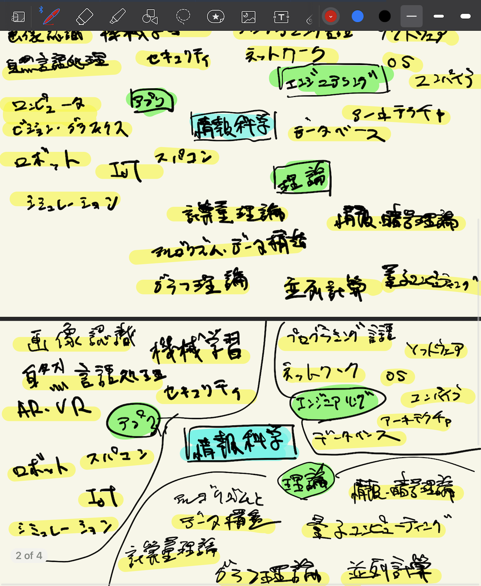
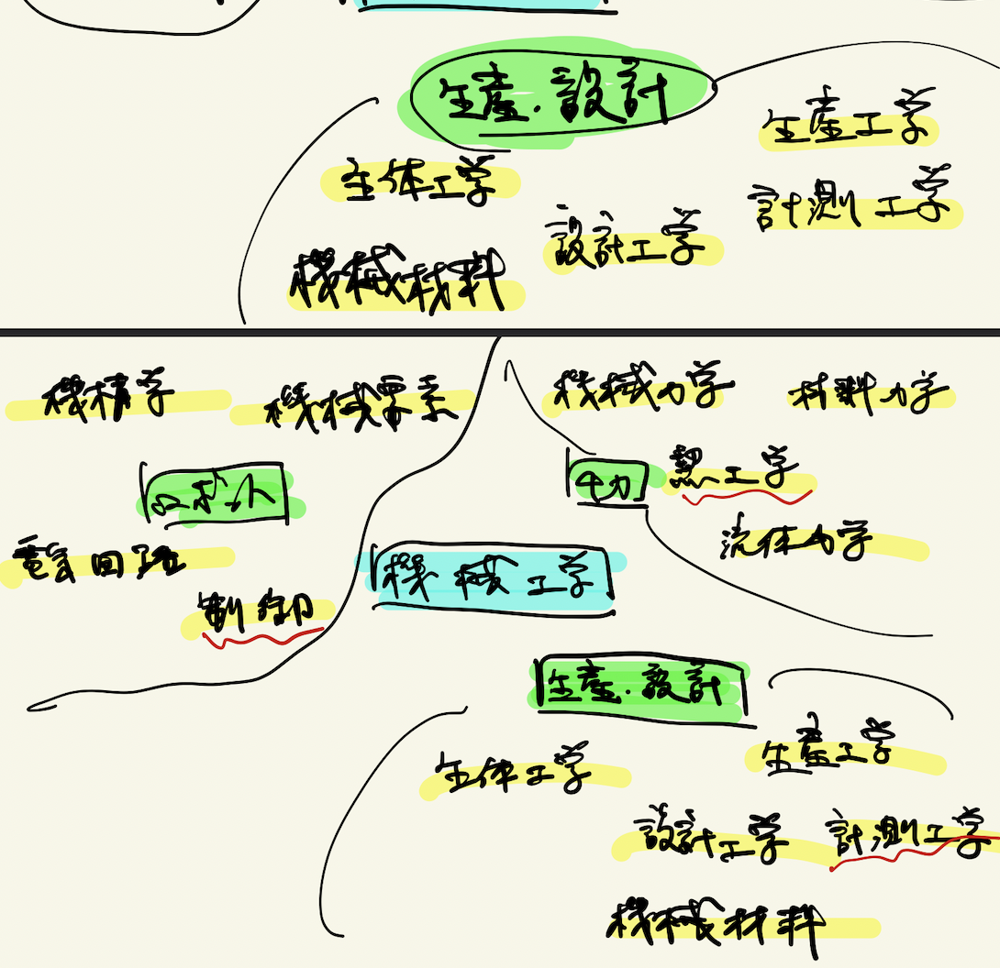
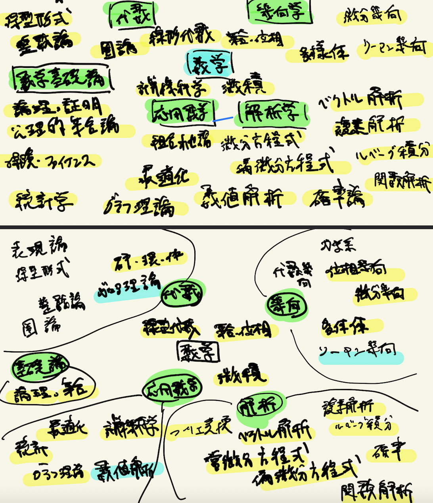
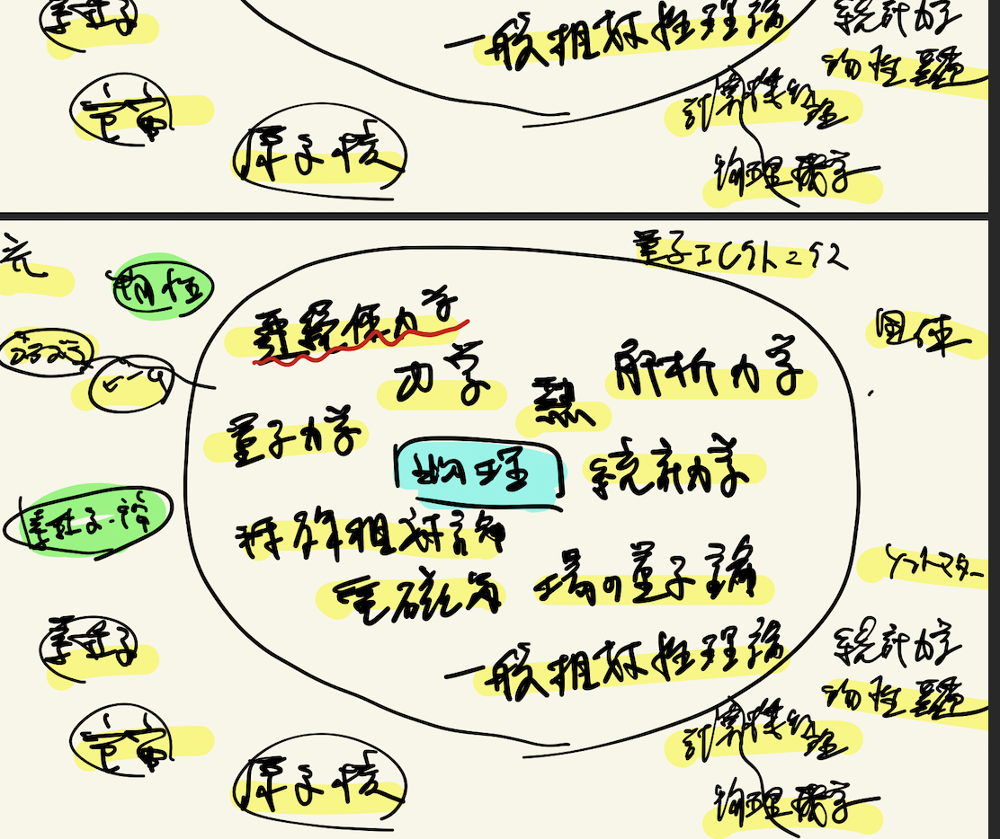
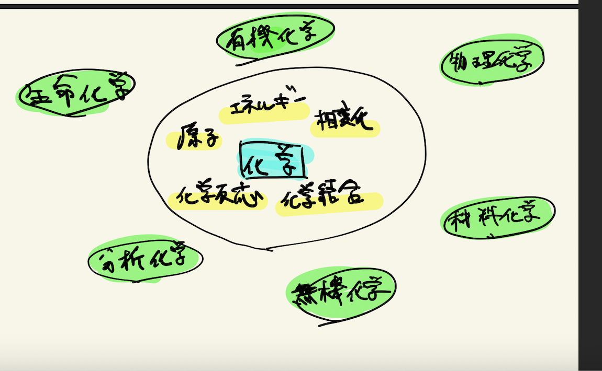
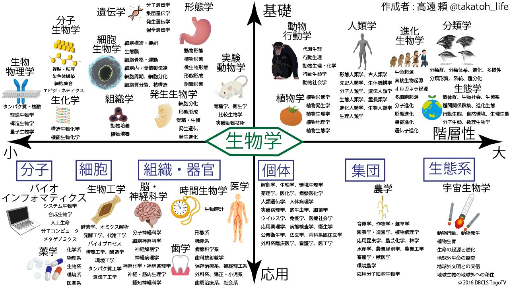
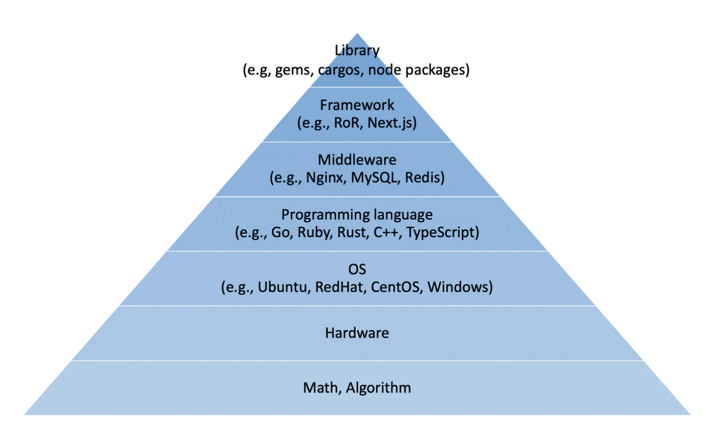

# 数学・物理・情報科学・機械工学の分野マップ(独断と偏見)

学部2年のときに分野を地図にし、知らないところを埋めようとしていた経緯。

原ページ作成：2023-01-09 ／ 最終更新：2023-01-31（UTC、取得時点）

[数学の入口](../README.md) · [当時の本文](#original) · [AIによる補足](#ai-notes) · [原文テキスト](../sources/original-field-map.txt) · [Scrapbox](https://scrapbox.io/MistMavGamer/%E6%95%B0%E5%AD%A6%E3%83%BB%E7%89%A9%E7%90%86%E3%83%BB%E6%83%85%E5%A0%B1%E7%A7%91%E5%AD%A6%E3%83%BB%E6%A9%9F%E6%A2%B0%E5%B7%A5%E5%AD%A6%E3%81%AE%E5%88%86%E9%87%8E%E3%83%9E%E3%83%83%E3%83%97%28%E7%8B%AC%E6%96%AD%E3%81%A8%E5%81%8F%E8%A6%8B%29)

本文は当時の言葉・並び・疑問を残した移植です。講義・読書由来の記述や過去のAI回答も含み、すべてを本人の独自の考察や確認済みの事実とは扱いません。冒頭の案内と末尾の補足は今回AIが追加しました。

## 思考の手がかり

> 学部2年のとき(4年前)に、いろんな学問の領域をマップにして、知らないところを潰していこうとしてたんですけど、その頃描いたマップが出てきました

[本文の該当箇所へ](#source-L2)

> これに基づいて、メモ帳のフォルダ構成を作ってました

[本文の該当箇所へ](#source-L3)

## 当時の本文

原文の字下げは引用段落の深さで表しています。順序はページ内の並びであり、学習した日時順を保証するものではありません。

<!-- BEGIN IMPORTED BODY: preserve historical wording -->

### 数学・物理・情報科学・機械工学の分野マップ(独断と偏見)

> 学部2年のとき(4年前)に、いろんな学問の領域をマップにして、知らないところを潰していこうとしてたんですけど、その頃描いたマップが出てきました  
> これに基づいて、メモ帳のフォルダ構成を作ってました  
> 今みたら、粒度感よくわからないし抜けてる分野もあるんですけど、大雑把に雰囲気はつかめると思います  
> 文字が汚いのは許してください・・  
> 専門の人が見たらツッコミどころあるかと思いますが、これは流石にやってるやろ！ってミスがあれば指摘してください  
> 全部、学部レベルでそっから先の広がりは分かりませんし、書いてません  

> 情報科学  

> > 今はけっこう分け方が違いますね  
> > 低レイヤー〜アプリまでレイヤー別で分けようか、直観的な分野で分けちゃおうかな〜とかいろいろ考えてました  
> > 2年前の分野の分け方は下の文字ベースです  

 ([画像の出典](<https://scrapbox.io/files/63bbb42d6bc0ca001e2c03f5.png>))  

> 理論  

情報・暗号理論  
計算量理論  
アルゴリズム・データ構造  
並列計算  
量子コンピューティング  

> エンジニアリング  

プログラミング言語  
OS  
コンピュータアーキテクチャ  
ネットワーク  
コンパイラ  
ソフトウェア  
データベース  

> アプリ  

機械学習  
画像認識  
自然言語処理  
セキュリティ  
最適化  
コンピュータビジョン・グラフィクス(VR,AR)  
ビッグデータ  
スーパーコンピュータ  
シミューレション  
UI  
IoT  

> Development  

Web  
iOS  
Infrastructure  

> 機械工学  

> > 2年前は文字ベースです  

 ([画像の出典](<https://scrapbox.io/files/63bbb4aba64c0d0022aad711.png>))  

> 製造業における機械工学分野  

機械力学  
熱工学  
材料力学  
流体力学  
設計工学  
制御工学  
経営工学  
生産工学  
生体工学  
機械要素  
機械材料  
機構学  
計測工学  
電気回路  

> 研究対象と分野  

飛行機  
自動車  
船舶  
ロボット  
ロケット  
鉄道機器  
医療機器  

> 数学  

> > 2年前の分け方は文字ベースです  

 ([画像の出典](<https://scrapbox.io/files/63bbb4dfe5c627001dd6d65b.png>))  

・基礎  
線形代数  
微分積分  
集合位相  

・解析  
微分方程式  
偏微分方程式  
複素解析  
ベクトル解析  
フーリエ変換・ラプラス変換  
ルベーグ積分  
確率論  

・幾何  
多様体  
位相幾何  
微分幾何  
リーマン幾何  
力学系  

・代数学  
整数論  
表現論  
Galois理論  
Lie群  
加群  
保型形式  
圏論  

・応用数学  
計算機科学  
グラフ理論  
最適化数理  
数値解析  
保険数理・数理ファイナンス  
組み合わせ論  
統計学  

・数学基礎論  
論理学・証明論  
公理的集合論  

> 物理学  

> > いろいろ分け方悩んでました、２年前は文字ベースです  

 ([画像の出典](<https://scrapbox.io/files/63bbb5048269fc001d8335fa.png>))  

・基礎物理  
古典力学  
連続体力学  
熱力学  
解析力学  
統計力学  
電磁気学  
量子力学  
特殊相対論  
場の量子論  
一般相対性理論  

・専門  
-素粒子・宇宙物理  
素粒子  
原子核  
宇宙  

-物性物理  
統計力学・物性基礎  
固体物理  
量子エレトロニクス  
ソフトマター  
光物性・量子光学  

-つなぎ  
計算機物理  
物理数学  
ビーム物理  
プラズマ  

> 化学  

> > 大学ではあんまやってないので、解像度めちゃ低いです・・  

 ([画像の出典](<https://scrapbox.io/files/63bbb55eba0764001ebb248b.png>))  

--------------------------------------------------------------------------------------------  
参考リンクなど  

> <http://blog.livedoor.jp/art32sosuu/archives/77860205.html>  

[loadmap2010-1.pdf](<https://scrapbox.io/files/63bbb68aba0764001ebb3175.pdf>)  

> @takatoh\_lifeさんの生物マップ  

 ([画像の出典](<https://scrapbox.io/files/63bbb98efd8bca001eb3cd45.jpeg>))  

> 物理は予備ノリがやってたのを参考にした気がする  

> ITスキル標準  

> > <https://www.ipa.go.jp/jinzai/itss/download_V3_2011.html>  

 ([画像の出典](<https://scrapbox.io/files/63bbba013838f8001efe6dc3.png>))  

<!-- END IMPORTED BODY -->

## AIによる補足・訂正（2026-09-20）

本文には、分野を地図にして知らないところを埋めようとしたことと、それをフォルダ構成に使ったことが明記されている。この動機は今回の整理にも引き継ぐ。ただし「4年前」などは原文執筆時の相対表現であり、移植日の4年前と読み替えない。図の分類と今の分類の違いは、関心の変化として併存させる。

この補足は今回の整理で追加した導入・確認の観点です。元の本文全体の証明や出典を校閲済みという意味ではありません。

## つながる移植ノート

- [同じ分野のノート](README.md)：学びの経緯・分野マップ。

原文の来歴・欠落の一覧は[移植記録](../import-report.md)を参照してください。
