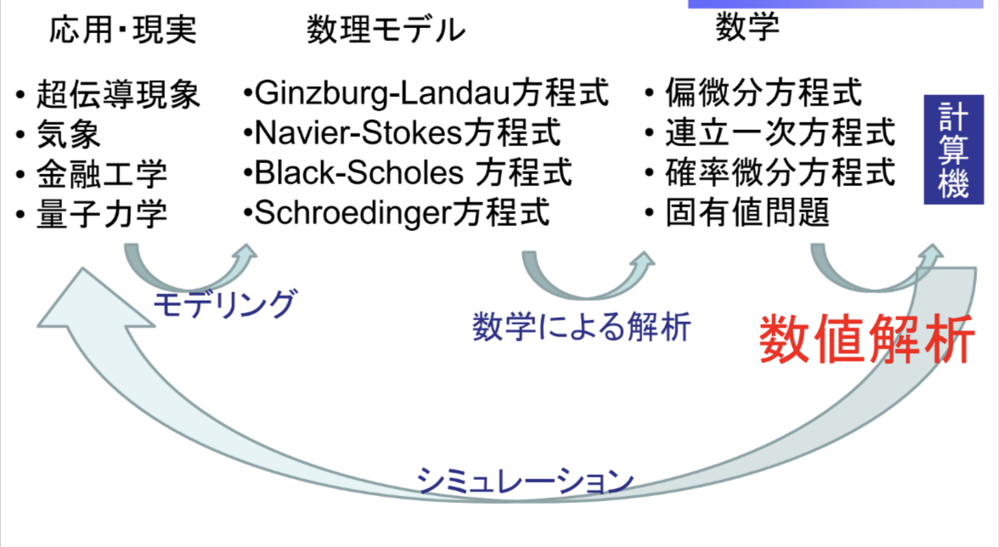
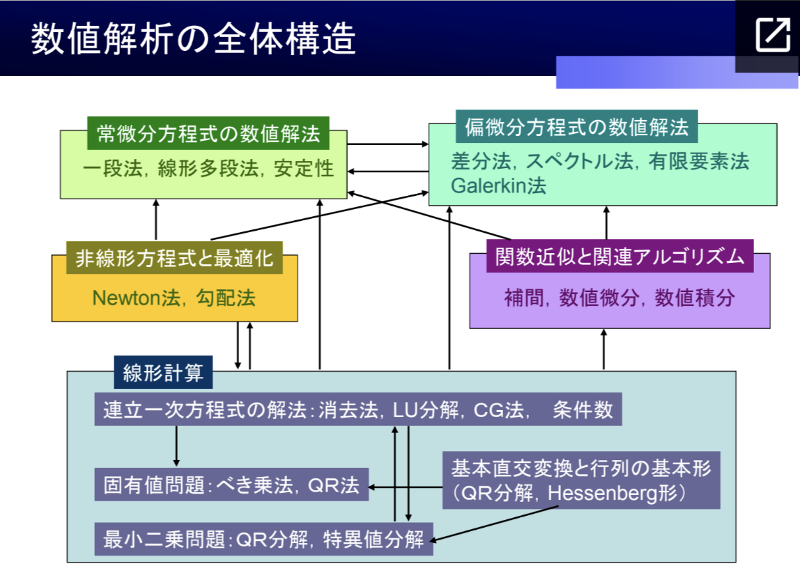

# 数値解析

精度と計算量を意識した講義メモ。途中でメモを続ける負担が増えたことも残る。

原ページ作成：2023-01-21 ／ 最終更新：2023-01-21（UTC、取得時点）

[数学の入口](../README.md) · [当時の本文](#original) · [AIによる補足](#ai-notes) · [原文テキスト](../sources/numerical-analysis.txt) · [Scrapbox](https://scrapbox.io/MistMavGamer/%E6%95%B0%E5%80%A4%E8%A7%A3%E6%9E%90)

本文は当時の言葉・並び・疑問を残した移植です。講義・読書由来の記述や過去のAI回答も含み、すべてを本人の独自の考察や確認済みの事実とは扱いません。冒頭の案内と末尾の補足は今回AIが追加しました。

## 思考の手がかり

> 途中でメモがだるくなってしまった

[本文の該当箇所へ](#source-L6)

本文の見出しから探す

- [第1回 数値解析とは](#source-L8)
- [第2回 数値の表現と誤差](#source-L57)
- [第3回 連立一次方程式の解法（直接法）](#source-L131)
- [第4回 連立一次方程式の解法（反復法）](#source-L184)
- [第5回 固有値問題の解法](#source-L241)
- [第6回 固有値問題、非線型方程式](#source-L287)
- [第7回 非線型方程式](#source-L309)
- [第8回 関数の近似と補間](#source-L331)
- [第9回 数値積分](#source-L353)
- [第10回 常微分方程式の数値解法](#source-L380)
- [第11回 偏微分方程式の数値解法](#source-L406)
- [第12回 偏微分方程式の数値解法](#source-L435)
- [1. Simultaneous Equations (Direct method) (連立方程式(直接法))](#source-L465)
- [2. Simultaneous Equations (Iterative method) (連立方程式(反復法))](#source-L466)
- [3. Non-linear problems (非線形方程式の解法)](#source-L467)
- [4. Non-linear problems (非線形方程式の解法)](#source-L468)
- [5. Eigenvalue problems (固有値問題)](#source-L469)
- [6. Numerical Errors (数値誤差)](#source-L470)
- [7. Numerical Difference (差分)](#source-L471)
- [8. Numerical Interpolation (数値補間)](#source-L472)
- [9. Numerical Integration (数値積分)](#source-L473)
- [10. Ordinal Differential Equations (常微分方程式)](#source-L474)
- [11. Eigenvalue problems (固有値問題)](#source-L475)
- [12. Eigenvalue problems (固有値問題)](#source-L476)
- [13. Ordinal Differential Equations (常微分方程式)](#source-L477)
- [14. Partial Differential Equations (偏微分方程式)](#source-L478)

## 当時の本文

原文の字下げは引用段落の深さで表しています。順序はページ内の並びであり、学習した日時順を保証するものではありません。

<!-- BEGIN IMPORTED BODY: preserve historical wording -->

### 数値解析

> 神講座をみましょう！  

> > <https://elf-c.he.u-tokyo.ac.jp/courses/226>  
> > 以下メモ  
> > 途中でメモがだるくなってしまった  

### 第1回 数値解析とは

1-1 数値解析について  
数値解析　＝　問題を数値的に解析する  

ゴール  
・数値解析の用途  
・数値解析の使い方  
・数値解析の数理  
を理解し、使えるようになる  

いつかどこかで数値解析をする羽目になるので、聞いておくべき  
１００万円かかるプログラムを書くか、１万円で住むプログラムを書くのはを決める  

線形計算、非線形方程式と最適化、関数近似と関連アルゴリズム、常微分方程式を理解して初めて偏微分方程式が溶けるようになる  

数学、情報科学、諸科学を知ると数値解析ができるようになり様々なものに応用できる  
 ([画像の出典](<https://scrapbox.io/files/63cbc217ef728e001e0bbed5.png>))  
 ([画像の出典](<https://scrapbox.io/files/63cbc21fc4d028001d132771.png>))  

1-2 数値解析の難しさ  
数値解析では、計算過程の解析もする  
これをしないとひどい目にある  

根本的な困難：有限のメモリ、有限の数値、有限の手順、四則演算など、全ては無限との戦いである  
もっと厳密には、足し算と引き算しか理解できない  
大体の計算機では有効数字15桁ほど  

計算量は極めて大事、O(n^3)はまだ頑張ればなんとかなるが、O(n^4)以上はやりたくなさすぎる  

1-3 数値計算の落とし穴  
漸化式は特性根求めて、係数を求めるだけ  
だが、漸化式でもおかしいことが起こるこの惨事の原因は計算機の有限性である  

1-4 落とし穴の対処法と教訓  
例えば、漸化式やbessel関数の計算は前から後ろに計算してはいけない  
これは工夫すれば解ける  
無限を前提に組み立てた数学の世界から見ると有限しか許されない故に不完全で壊れている  
数値解析学者は、誤差収拾人ではなく、優れた分析官である  

1-5 数値解析例まとめ  
自然は最小を好む、という思想で物理法則を組み立てると、今のところ矛盾なくうまくいっている  
超電導現象の計算例  

### 第2回 数値の表現と誤差

2-1 浮動小数点数の導入  
浮動小数点数  

2-2 単精度/倍精度で表現できる数  
単精度で表現できる数の範囲  
最小の数：2^-126 \~ 1.175\*10^-38  
最大の数：2^127\*2 \~ 3.4\*10^38  
有効数字桁数：2^24 \~ 10^7  
倍精度  
最小：2.225\*10^-308  
最大：1.798\*10^308  
有効数字桁数：10^15  

有効数字桁数が一番大事  
アンダーフローよりもオーバーフローの方が怖い  
大きな数の世界ではスカスカな数で計算をしている  

2-3 Machine epsilon  
machine epsilonは相対誤差  
x\_f/x = 1 + ε\_xで表現できる  
単精度であれば、εは10^-7ぐらい、倍精度なら10^-15ぐらい  

2-4 丸め誤差  
浮動小数点数が線形空間を成さないので、無理やり線形空間に入れるための誤差  
１０回計算したら有効数字が１桁ずれる可能性がある  

2-5 桁落ち誤差  
近い数の引き算で発生する、著しい有効数字減少  
例えば、二次方程式の解の公式でb &gt;&gt; acのとき  
プラスか、マイナスかどちらかが悪い時は、分子を有利化すべし  

2-6 積み残し  
大きな数と小さな数を足したら小さな数が無視される  
良い例として、バーゼル問題  
うしろから足したり、より収束の早い表現を探したりする  

2-7 区間演算  
区間演算というのはどこまでの範囲であるか、を示す演算方法  
expなどが混じると何も言っていないことになる  

2-8 連立一次方程式を解くとは  
線形代数的に連立一次方程式が解けるということと、科学者が連立一次方程式を計算機に解かせるには大きなギャップがあり、まだ一般解は存在しない  

2-9 Cramerの公式  
理論的にきれいでも、数値計算の役に立たない時がある  
detを計算する計算量はO(n!)なので無理ゲー  

2-10 逆行列を用いる方法  
A-1bで解く催促手順よりも、Ax=bを最速手順で解く方が早い  
数値計算の世界にきたら、逆行列を使うことは基本的にない  

2-11 行列とベクトルのノルム  
連立一次方程式を数値的に解けるかどうかで何が重要か  
距離を入れる方法がノルムである  
作用素にノルムを入れる時はsupで定義する時が多い  

2-12 摂動により生じる誤差の評価  
行列と係数ベクトルを少しずらして考える  
εを変えるごとに解も動く  
Aが正則なら十分小さなεに対してA+ε Fも正則  
テイラー展開したものを持ち手評価する  
「AとA^-1のノルム」が大きいと、誤差が拡大し、これを条件数と呼ぶ  
これをまず調べるべきである  
A^-1のノルムを計算するのは難しいので、これを評価する方法が色々と考えられている  

2-13 条件数のイメージと例  
条件数が大きいというのは、直線の交わりの角度が小さいということ  
計算機の中は脆い実数上で動いている  

### 第3回 連立一次方程式の解法（直接法）

3-1 連立一次方程式の直接法  

3-2 Gaussの消去法  
上三角行列にすれば求まる  
これを前進消去という  

3-3 Gaussの消去法：前進消去  
アルゴリズムで表せる形に消去の手順をシステマティックに書いていく  

3-4 Gaussの消去法：後退代入  
後退代入するときに0割をケアする  

3-5 Gaussの消去法：より一般の場合  
仮定をおいたが、その仮定が満たされていないときは考えられなかった  
このケア方法と、常にケアできるということを説明する  

3-6 Gaussの消去法：枢軸択付き  
対角成分が0になることや、0に近くなるのを避ける  
行を適切に入れ替えながら進めていく  

3-7 Gaussの消去法：計算量  
前進消去はO(n^3)、後退代入はO(n^2)となるので、Gaussの消去法の計算量は行列の大きさをnとしたときにO(n^3)であると覚えておく  

3-8 LU分解：導入と存在の証明  
実はGaussの消去法は別表現がある  
Gaussの消去法 = LU分解 + 後退代入  

3-9 LU分解：枢軸選択付き  
行方向を入れ替える  

3-10 LU分解：利点  
PA = LUに基づくAx = bの解法が使える  
一度LU分解をすれば高速に解けるようになる  

3-11 計算量の比較  

逆行列からxを求める積極的な理由は存在しない  
LUルートを通るべきである  

3-12 注意点：fill in  
疎→密にする  
反復法はn^3に耐えられないときに使う  

3-13 注意点：Cholesky分解  
LU分解の特別な場合  
名前だけ覚えておく  

3-14 LU分解：アルゴリズム  

### 第4回 連立一次方程式の解法（反復法）

4-1 反復法  
直接法はO(n^3)で答えが出る  
fill-inで疎性がこわれる  
反復法はO(n^2)の反復を行うが、厳密解にはいかない  
直接法は「密」で「小」  
反復法は「疎」で「大」  

反復法  
・定常反復法：Jacobi, GS, SOR  
・非定常反復法：CG  

4-2 Jacobi法  
一番簡単  

4-3 Gauss-Seidel法  
計算する際に最新の値を用いる  

4-4 SOR法  
物理やさんがよく使う手法  
わかりにくい  

4-5 反復法の収束  
収束するかわからかんけど、漸化式立ててみたっていうのが上の３つである  
それについて数学的に言える定理がある  

上の3つはHとCの取り方が違うだけ  

4-6 反復法の収束と縮小写像の原理との関係  
縮小写像の原理はBanachの不動点定理ともいう  
実は反復法の収束と縮小写像の原理は関係がある  

4-7 Jacobi法の収束  
Aが狭義優対角であればJacobi法は収束する  

4-8 SOR法の収束  
SOR法の収束のための必要条件 0 &lt; ω &lt; 2  
実際のωは経験則  

4-9 CG法のアルゴリズム  
最急降下法の親戚のようなアルゴリズム  

4-10 CG法の意味1  

4-11 CG法の意味2  

4-12 CG法の直接法的側面と反復法的側面  
非常にうまいアルゴリズムである  

反復法であるが、計算量の上限は有限である  
丸め誤差に弱くなっているので、真の解に行かないこともある  

固有値が全てのにているときに、真の解に近づくスピードがあがる  

### 第5回 固有値問題の解法

5-1 CG法の収束性  
最急降下方向は真円じゃないとうまくいかないことがあるので、やめましょうというのがCG法である  
CG法では、マルメごさがなければ有限回で終わる！！  
反復法はどういう時に有益かというと、次元数より小さいところで計算を打ち切ることを期待している  
早い場合とは、条件数が小さい場合  
つまり、ドカンを落ちるのを期待している  

実際、CG法を使う時には、そのまま使うわけではなく、前処理というものをする  

5-2 前処理  
CG法では、前処理はパッケージとしてついてくるのでそれを選択できれば良い  
これスキー分解できればもう解けていることになるので、それをどうサボるか考えるのが数理の考え方  

5-3 非対称行列のCG法  
いろいろな研究がされている  
前処理行列がケースバイケースなのが問題である  
フローチャートが存在する  
それを辿っていくとお勧めの方法がわかる  
数値計算では、スーパー解法がなく、ケースバイケースの世界である  
完全だった数学の世界を計算機に入れると辺なことがいっぱい起こる  

5-4 固有値問題の導入  
数学的にわかっていることと計算機で解けることにはギャップがある  
代数方程式の根は係数の摂動で大きく動く  
数学では、不変部分空間を求めるときはjordan標準形を求めることがゴールだが、数値計算ではそうではない  

5-5 相似変換  

5-6 QR法に向かって  

5-7 べき乗法  

5-8 逆反復法  

5-9 Gram-Schmidtの直交化法  

5-10 同時反復法  

5-11 行列のHesseberg化  

### 第6回 固有値問題、非線型方程式

6-1 QR法の続き1  

6-2 QR法の続き2  

6-3 非線型方程式の導入  

6-4 不動点反復  

6-5 縮小写像の原理の証明  

6-6 縮小写像の原理の解説1  

6-7 縮小写像の原理の解説2  

6-8 Newton法1  

6-9 Newton法2  

### 第7回 非線型方程式

7-1 Householder変換  

7-2 Householder変換によるHessenberg化  

7-3 Householder変換によるQR分解  

7-4 HessenbergQR法の各反復の計算量  

7-5 Newton法の収束速度  

7-6 関数の近似とは  

7-7 Lagrange補間とは  

7-8 Lagrange補間の表現1  

7-9 Lagrange補間の表現2  

7-10 Lagrange補間の表現3  

### 第8回 関数の近似と補間

8-1 Lagrange補間の誤差評価  

8-2 誤差評価の定理の証明  

8-3 多項式補間の失敗  

8-4 Lagrange補間の近似度1  

8-5 Lagrange補間の近似度2  

8-6 スプライン補間  

8-7 数値積分の導入  

8-8 補間に基づく積分公式  

8-9 補間に基づく積分公式（重み関数付き）  

### 第9回 数値積分

9-1 直交多項式の性質  

9-2 Gauss公式  

9-3 Gauss公式の誤差評価  

9-4 DE公式  

9-5 DE公式の離散化誤差  

9-6 DE公式の打ち切り誤差  

9-7 誤差のトレードオフとDE公式の有用性  

9-8 常微分方程式の数値解放  

9-9 解の存在定理  

9-10 高階の常微分方程式  

9-11 陽的Euler法と陰的Euler法  

9-12 台形則と陰的中点則  

### 第10回 常微分方程式の数値解法

10-1 常微分方程式の数値解法  

10-2 解法の精度（次数）  

10-3 4次Runge-kutta法  

10-4 解法の図示：陽的・陰的Euler法  

10-5 解法の図示：陰的中点則・台形則  

10-6 解法の図示：４次Runge-kutta法  

10-7 多段法  

10-8 安定性の観察  

10-9 安定性解析：陽的中点則  

10-10 安定性解析：陽的・陰的Euler法  

10-11 安定性解析：Runge-kutta法  

### 第11回 偏微分方程式の数値解法

11-1 マシンイプシロンの数値実験  

11-2 積み残しの数値実験  

11-3 Newton法の数値実験  

11-4 Lagrange補間の数値実験  

11-5 陽的Euler法の数値実験  

11-6 陰的Euler法の数値実験  

11-7 陽的中点則と台形則の数値実験  

11-8 偏微分方程式の型  

11-9 偏微分方程式の数値解法の導入  

11-10 Poisson方程式と差分  

11-11 1次元Poisson方程式に対する差分法  

11-12 2次元Poisson方程式に対する差分法  

11-13 複雑な境界形状の取り扱い  

### 第12回 偏微分方程式の数値解法

12-1 楕円型偏微分方程式の解法1  

12-2 楕円型偏微分方程式の解法2  

12-3 双曲型偏微分方程式の解法  

12-4 陽的Eulerスキームの安定性  

12-5 その他のスキームの例  

12-6 放物型偏微分方程式の解法  

> 「数値解析とは何か？」  

コンピュータは離散的な値しか扱えないので数式ではなく数値によらなければならない  
しかし数値で扱うには誤差などの要因を考えなければならない  

複雑な数式から簡単な代数式に置き換え、解そのものを数値だけで扱う  

誤差→単一方程式→連立方程式→微分積分＋（補完法）→状微分方程式→偏微分方程式  

> 機械系数値解析  

Mechanic Numerical Analysis  

### 1. Simultaneous Equations (Direct method) (連立方程式(直接法))

### 2. Simultaneous Equations (Iterative method) (連立方程式(反復法))

### 3. Non-linear problems (非線形方程式の解法)

### 4. Non-linear problems (非線形方程式の解法)

### 5. Eigenvalue problems (固有値問題)

### 6. Numerical Errors (数値誤差)

### 7. Numerical Difference (差分)

### 8. Numerical Interpolation (数値補間)

### 9. Numerical Integration (数値積分)

### 10. Ordinal Differential Equations (常微分方程式)

### 11. Eigenvalue problems (固有値問題)

### 12. Eigenvalue problems (固有値問題)

### 13. Ordinal Differential Equations (常微分方程式)

### 14. Partial Differential Equations (偏微分方程式)

<!-- END IMPORTED BODY -->

## AIによる補足・訂正（2026-09-20）

問題そのものの敏感さ（条件）と、アルゴリズムが誤差をどう増幅するか（安定性）を区別する。可逆行列 $A$ の条件数は、選んだ行列ノルムに対して $\kappa(A)=\|A\|\,\|A^{-1}\|$。原文の「ノルムが大きい」という説明には、この積とノルムの指定を補う。相対残差が小さくても、悪条件なら相対誤差が大きいことがある。

この補足は今回の整理で追加した導入・確認の観点です。元の本文全体の証明や出典を校閲済みという意味ではありません。

## つながる移植ノート

- [同じ分野のノート](README.md)：最適化・数値計算。

原文の来歴・欠落の一覧は[移植記録](../import-report.md)を参照してください。
