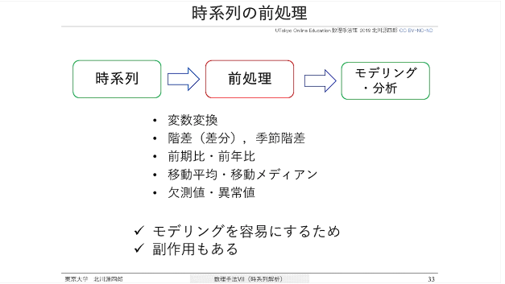
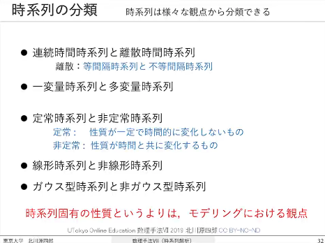

# 時系列解析

時間のあるデータを扱う手法と、状態空間モデルなどへの関心。

原ページ作成：2023-01-21 ／ 最終更新：2025-09-04（UTC、取得時点）

[数学の入口](../README.md) · [当時の本文](#original) · [AIによる補足](#ai-notes) · [原文テキスト](../sources/time-series-analysis.txt) · [Scrapbox](https://scrapbox.io/MistMavGamer/%E6%99%82%E7%B3%BB%E5%88%97%E8%A7%A3%E6%9E%90)

本文は当時の言葉・並び・疑問を残した移植です。講義・読書由来の記述や過去のAI回答も含み、すべてを本人の独自の考察や確認済みの事実とは扱いません。冒頭の案内と末尾の補足は今回AIが追加しました。

本文の見出しから探す

- [第1講 時系列の前処理](#source-L37)
- [1 独立な観測データ](#source-L40)
- [2 時系列データ](#source-L41)
- [3 空間データ](#source-L42)
- [4 時空間データ](#source-L43)
- [第2講 共分散関数、スペクトルとピリオドグラム](#source-L54)
- [第3講 統計的モデリング・情報量規準AIC](#source-L58)
- [第4講 モデルの推定・選択](#source-L62)
- [第5講 ARMAモデルによる時系列の解析](#source-L66)
- [第6講 ARモデルの推定](#source-L70)
- [第7講 局所定常ARモデル](#source-L74)
- [第8講 状態空間モデル](#source-L77)
- [第9講 ARMAモデルの最尤推定とトレンドモデル](#source-L80)
- [第10講 季節調整モデル：成分分解による情報抽出](#source-L83)
- [第11講 ボラティリティ、時変係数ARモデル](#source-L85)
- [第12講 非線型・非ガウス型状態空間モデル](#source-L87)
- [第13講 粒子フィルタ](#source-L89)
- [1 時系列データの解析とその準備](#source-L113)
- [2 共分散関数](#source-L114)
- [3 スペクトルとピリオドグラム](#source-L115)
- [4 モデリング](#source-L116)
- [5 最小二乗法](#source-L117)
- [6 ARMAモデルによる時系列の解析](#source-L118)
- [7 ARモデルの推定](#source-L119)
- [8 局所定常ARモデル](#source-L120)
- [9 状態空間モデルによる時系列の解析](#source-L121)
- [10 ARAMモデルの推定](#source-L122)
- [11 トレンドの推定](#source-L123)
- [12 季節調節モデル](#source-L124)
- [13 時変係数ARモデル](#source-L125)
- [14 非ガウス型モデル](#source-L126)
- [15 モンテカルロ・フィルタ](#source-L127)
- [16 シミュレーション](#source-L128)

## 当時の本文

原文の字下げは引用段落の深さで表しています。順序はページ内の並びであり、学習した日時順を保証するものではありません。

<!-- BEGIN IMPORTED BODY: preserve historical wording -->

### 時系列解析

[Kaggle](https://scrapbox.io/MistMavGamer/Kaggle)  
\[PythonではじめるKaggleスタートブック\]  
[異常検知](https://scrapbox.io/MistMavGamer/%E7%95%B0%E5%B8%B8%E6%A4%9C%E7%9F%A5)  
[基盤モデル](https://scrapbox.io/MistMavGamer/%E5%9F%BA%E7%9B%A4%E3%83%A2%E3%83%87%E3%83%AB)  
[生体情報論](https://scrapbox.io/MistMavGamer/%E7%94%9F%E4%BD%93%E6%83%85%E5%A0%B1%E8%AB%96)  
[異常検知](https://scrapbox.io/MistMavGamer/%E7%95%B0%E5%B8%B8%E6%A4%9C%E7%9F%A5)  
[ベイズ統計](bayesian-statistics.md)  
[線形代数](../linear-algebra/linear-algebra.md)  
[確率過程](stochastic-processes.md)  
[MCMC](mcmc.md)  
[古典制御 + 現代制御](https://scrapbox.io/MistMavGamer/%E5%8F%A4%E5%85%B8%E5%88%B6%E5%BE%A1%20%2B%20%E7%8F%BE%E4%BB%A3%E5%88%B6%E5%BE%A1)  
[因果推論](causal-inference.md)  

時間とともに変動する現象を記録したデータが時系列である。時系列に基づき、複雑な現象を理解し、予測、制御や意思決定を行うための方法が時系列解析である。この講義では、時系列のモデリングのための前処理や特徴の可視化、統計的モデリングの方法、線形・定常時系列モデル、状態空間モデルおよび非線形・非ガウス型モデルについて、実際の問題への応用含めつつモデリングの方法を中心に解説し、現実の問題に対応して適切なモデリングができるようになることを目標とする。  

> > (１）時系列の特徴の可視化とモデリングのための前処理  
> > １．時系列・時系列の前処理・シミュレーション  
> > ２．共分散関数とパワースペクトル  

（２）線形定常時系列モデリング  

> > ３．ARモデルの推定と予測  
> > ４．ARMAモデルによる時系列の解析  
> > ５．統計的モデリングと情報量規準AIC  
> > ６．最尤法と最小二乗法  
> > ７．局所定常ARモデリング  

（４）状態空間モデリング  

> > ８．状態空間モデルによる時系列の解析  
> > ９．ARMAモデルの推定，トレンドの推定  
> > １０．季節調整モデル，時系列の成分分解  
> > １１．時変分散モデル，時変係数ARモデル  

（５）非線形・非ガウス型モデリング  

> > １２．非ガウス型状態空間モデル  
> > １３．粒子フィルタ  

### 第1講 時系列の前処理

複雑な現象を理解して、予測、制御や意思決定を行うための方法が時系列解析である  

### 1 独立な観測データ

### 2 時系列データ

### 3 空間データ

### 4 時空間データ

 ([画像の出典](<https://scrapbox.io/files/63cbc33e3502f0001d223e4b.png>))  

データプロット  
時間相関を可視化  
周期性を可視化（スペクトル、ピリオドグラム）  

 ([画像の出典](<https://scrapbox.io/files/63cbc33682aaba001e5d2bc5.png>))  

### 第2講 共分散関数、スペクトルとピリオドグラム

### 第3講 統計的モデリング・情報量規準AIC

### 第4講 モデルの推定・選択

### 第5講 ARMAモデルによる時系列の解析

### 第6講 ARモデルの推定

### 第7講 局所定常ARモデル

### 第8講 状態空間モデル

### 第9講 ARMAモデルの最尤推定とトレンドモデル

### 第10講 季節調整モデル：成分分解による情報抽出

### 第11講 ボラティリティ、時変係数ARモデル

### 第12講 非線型・非ガウス型状態空間モデル

### 第13講 粒子フィルタ

> 系列データ、NNが何でも変換できるといえど、明示的に分かってる特徴は作ってあげたほうが良いので、ラグ特徴量に加えてスペクトルと包絡線もブチ込みまくればええんでないか！！！おらおらover-parametrizationだぜ！！！  

<https://twitter.com/ML_deep/status/1630629766218018816?s=20>  

> Numpyroでの状態空間モデル(ローカル線形トレンド+周期性モデル)の実装方法について解説しています。  

<https://twitter.com/pagumi_bayesian/status/1637331828251201537?s=20>  

> 最先端時系列データ分析モデルETSformerを使ってみた  

<https://qiita.com/Isaka-code/items/848589fc4d7dd153e915>  

> 時系列解析入門  

### 1 時系列データの解析とその準備

### 2 共分散関数

### 3 スペクトルとピリオドグラム

### 4 モデリング

### 5 最小二乗法

### 6 ARMAモデルによる時系列の解析

### 7 ARモデルの推定

### 8 局所定常ARモデル

### 9 状態空間モデルによる時系列の解析

### 10 ARAMモデルの推定

### 11 トレンドの推定

### 12 季節調節モデル

### 13 時変係数ARモデル

### 14 非ガウス型モデル

### 15 モンテカルロ・フィルタ

### 16 シミュレーション

> ダイナミックな時系列データでの過学習を防ぎ予測精度を上げる正則化手法WaveBound  

<https://ai-scholar.tech/articles/time-series/wavebound>  

> Kaggleで学ぶ系列データのための深層学習モデリング  

<https://speakerdeck.com/yu4u/kaggletexue-huxi-lie-tetanotamenoshen-ceng-xue-xi-moterinku>  

> squeezeformer  

<https://github.com/kssteven418/Squeezeformer>  

> 実践 時系列解析  

1章 時系列の概論と簡単な歴史  
2章 時系列データの見つけ方と処理  
3章 時系列の探索的データ解析  
4章 時系列データのシミュレーション  
5章 時間データの保管  
6章 時系列データに使える統計モデル  
7章 時系列に使える状態空間モデル  
8章 特徴量の生成と選択  
9章 機械学習による時系列解析  
10章 ディープラーニングによる時系列解析  
11章 誤差の測定  
12章 時系列モデルの当てはめと提供の性能に関する考慮事項  
13章 ヘルスケア分野への適用  
14章 金融分野への適用  
15章 政府機関が公表する時系列  
16章 時系列パッケージ  
17章 予測の予測  

> 時系列基盤モデルChronos-Boltでお手軽に時系列予測を試してみた  

<https://acro-engineer.hatenablog.com/entry/2025/02/18/120000?utm_source=substack&utm_medium=email>  

> Harnessing Vision Models for Time Series Analysis: A Survey  

<https://arxiv.org/abs/2502.08869>  

画像から時系列解析をするのか  

> EEGPT  

<https://github.com/BINE022/EEGPT>  

> TIMERAG: BOOSTING LLM TIME SERIES FORECASTING VIA RETRIEVAL-AUGMENTED GENERATION  

<https://arxiv.org/pdf/2412.16643>  

> TimeGPT-1  

<https://arxiv.org/pdf/2310.03589>  

> 生存時間解析 ―時間とイベント発生の関係―  

<https://www.jstage.jst.go.jp/article/jjrmc/59/11/59_59.1118/_pdf>  

> 幅広い時空間データの統計モデリングにより各種要因の影響を分析  

<https://www.ism.ac.jp/ism_info_j/labo/project/159.html>  

> 基礎からわかる時系列分析 ―Rで実践するカルマンフィルタ・MCMC・粒子フィルタ―  

<https://gihyo.jp/book/2018/978-4-7741-9646-6>  

> 時系列分析と状態空間モデルの基礎: RとStanで学ぶ理論と実装  

<https://www.amazon.co.jp/時系列分析と状態空間モデルの基礎-RとStanで学ぶ理論と実装-馬場-真哉/dp/4903814874>  

> 2014-06-27 Stanで統計モデリングを学ぶ(6): 階層ベイズモデルで季節調整を行う  

<https://tjo.hatenablog.com/entry/2014/06/27/190502>  

> CausalImpact  

<https://google.github.io/CausalImpact/CausalImpact.html>  

<!-- END IMPORTED BODY -->

## AIによる補足・訂正（2026-09-20）

時間の順序があるデータでは、ランダム分割すると未来の情報が学習側へ漏れる場合がある。予測時点で入手できた変数だけを使い、時間順の評価を検討する。定常性、トレンド、季節性、外生変数の扱いをモデルごとに明示すると、手法名の一覧を実際の判断へつなげられる。

この補足は今回の整理で追加した導入・確認の観点です。元の本文全体の証明や出典を校閲済みという意味ではありません。

## つながる移植ノート

- [ベイズ統計](bayesian-statistics.md)
- [線形代数](../linear-algebra/linear-algebra.md)
- [確率過程](stochastic-processes.md)
- [MCMC](mcmc.md)
- [因果推論](causal-inference.md)

原文の来歴・欠落の一覧は[移植記録](../import-report.md)を参照してください。
