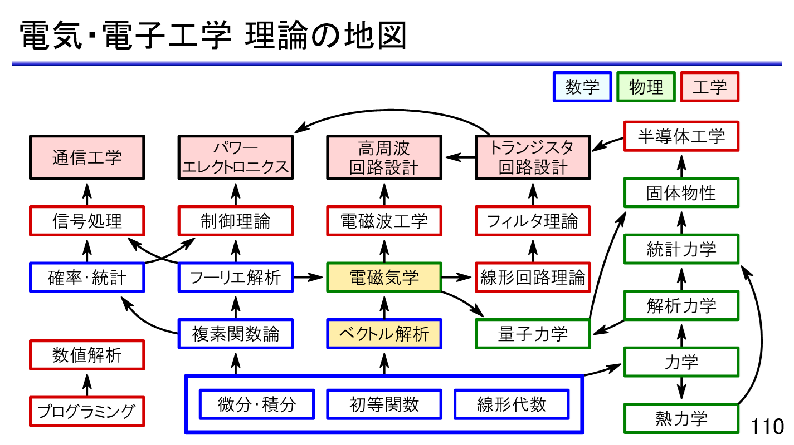

# 電気の理論の地図

「機械系と似ている？」という疑問と、電気分野の地図。

原ページ作成：2023-01-22 ／ 最終更新：2023-01-22（UTC、取得時点）

[物理学の入口](../README.md) · [当時の本文](#original) · [AIによる補足](#ai-notes) · [原文テキスト](../sources/electrical-theory-map.txt) · [Scrapbox](https://scrapbox.io/MistMavGamer/%E9%9B%BB%E6%B0%97%E3%81%AE%E7%90%86%E8%AB%96%E3%81%AE%E5%9C%B0%E5%9B%B3)

本文は当時の言葉・並び・疑問を残した移植です。講義・読書由来の記述や過去のAI回答も含み、すべてを本人の独自の考察や確認済みの事実とは扱いません。冒頭の案内と末尾の補足は今回AIが追加しました。

## 思考の手がかり

> へ〜電気系はあまり詳しくないけど、機械系と似ている？

[本文の該当箇所へ](#source-L5)

## 当時の本文

原文の字下げは引用段落の深さで表しています。順序はページ内の並びであり、学習した日時順を保証するものではありません。

<!-- BEGIN IMPORTED BODY: preserve historical wording -->

### 電気の理論の地図

> あ  

> > <https://twitter.com/linear_tec/status/1616803623819960320?s=20&t=dydUqbjBZJjLOVJTtGHk9Q>  
> > へ〜電気系はあまり詳しくないけど、機械系と似ている？  

 ([画像の出典](<https://scrapbox.io/files/63ccc6d541fc89001d61feb4.png>))  

<!-- END IMPORTED BODY -->

## AIによる補足・訂正（2026-09-20）

「電気系はあまり詳しくないけど、機械系と似ている？」を読み直しの問いとして残す。線形なばね・質量・ダンパと直列RLC回路では微分方程式の形を対応させられるが、変数の単位は異なる。[保存則と構成式](../conservation-and-constitutive-laws.md)では、この対応と適用条件を確かめる。図は元の出典リンクとともに保存した。

この補足は今回の整理で追加した導入・確認の観点です。元の本文全体の証明や出典を校閲済みという意味ではありません。

## つながる移植ノート

- [同じ分野のノート](README.md)：電磁気・光・物質。

原文の来歴・欠落の一覧は[移植記録](../import-report.md)を参照してください。
