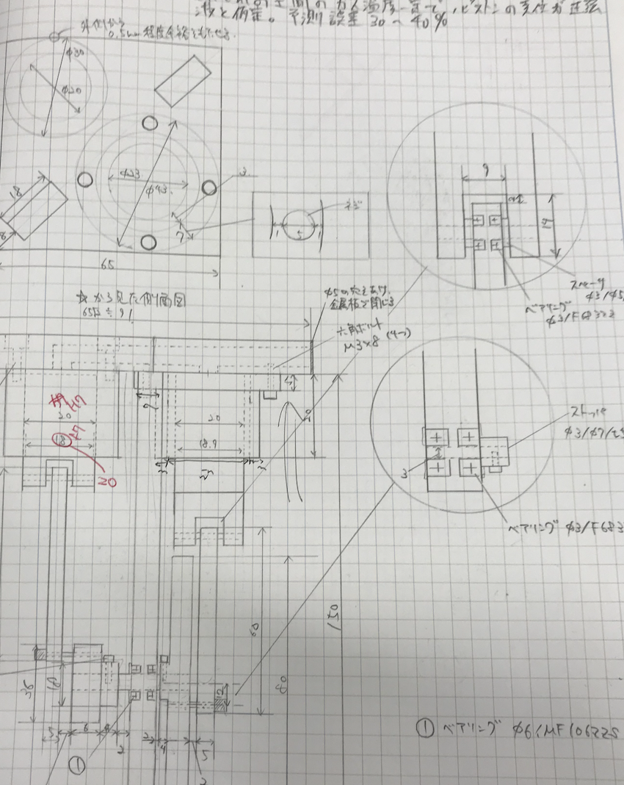

# スターリングエンジンを0から作る備忘録

手を動かしていて製作メモが残らなかった、という言葉と周辺の実習記録。

原ページ作成：2023-01-20 ／ 最終更新：2023-02-12（UTC、取得時点）

[物理学の入口](../README.md) · [当時の本文](#original) · [AIによる補足](#ai-notes) · [原文テキスト](../sources/stirling-engine-project.txt) · [Scrapbox](https://scrapbox.io/MistMavGamer/%E3%82%B9%E3%82%BF%E3%83%BC%E3%83%AA%E3%83%B3%E3%82%B0%E3%82%A8%E3%83%B3%E3%82%B8%E3%83%B3%E3%82%920%E3%81%8B%E3%82%89%E4%BD%9C%E3%82%8B%E5%82%99%E5%BF%98%E9%8C%B2)

本文は当時の言葉・並び・疑問を残した移植です。講義・読書由来の記述や過去のAI回答も含み、すべてを本人の独自の考察や確認済みの事実とは扱いません。冒頭の案内と末尾の補足は今回AIが追加しました。

## 思考の手がかり

> と思ったが、こればかりはずっと手を動かしていたので、メモがなかった・・

[本文の該当箇所へ](#source-L3)

## 当時の本文

原文の字下げは引用段落の深さで表しています。順序はページ内の並びであり、学習した日時順を保証するものではありません。

<!-- BEGIN IMPORTED BODY: preserve historical wording -->

### スターリングエンジンを0から作る備忘録

> と思ったが、こればかりはずっと手を動かしていたので、メモがなかった・・  

物体周りの流れ  
揚力と抗力は積分によって求める  
翼を囲む空間について運動量保存を考えても揚力はわかる  
揚力係数、抗力係数、モーメント係数、レイノルズ数など  

電子回路1(デジタル回路)  
ブレッドボードは小型の電子部品を用いた電子回路の施策にとても便利に作られています。  
ステッピングモータはパルス信号で一定角度ずつ高精度に回転するモータである。  

電子回路2(アナログ回路)  
連続的な信号であるアナログ信号を取り扱う回路をアナログ回路という。本演習では、メカトロニクスにおける自動制御機構に採用されているサーボ機構を設計・製作する。  
反転増幅器、積分・微分演算増幅器、演算増幅器、  
てすたの使い方、  

感温結晶を用いた温度の可視化計測  

Easy-σによる応力解析  
有限要素法では、同じ線の問題をメッシュの領域に分割し、変形を近似的にとく。  

ガスエンジンの性能  

計算機演習  

・バトルシップ  
コマンド  
cp main.c main2.c:main.cをmain2.cにコピー  
cp main main2 -r:mainというディレクトリをmain2というディレクトリにコピー  
less main.c:main.cの中身を見る  
Grep “”int” \*.c    
リバースエンジニアリング  
C言語コンパイルの流れ:プリプロセス→コンパイル→アセンブル→リンク  
ファイルの流れ:ソースファイル→アセンブラソースファイル→オブジェクトファイル→バイナリファイル  
プリプロセス:マクロの展開や#includeなどの直接的な処理が行われる、.iファイルができる  
（狭義の）コンパイル:プリプロセスが終わったらコンパイルでアセンブラに変換される  
デバッグオプションをつけるとファイルの大きさが膨れあがる、.sファイルができる  
アセンブル:狭義のコンパイルで得たファイルをアセンブルしてバイナリのオブジェクトファイルを生成する  
Objdumpやreadelfコマンドで詳細を確認できる、.oファイルができる  
リンク:必要なライブラリとの結合を行なって実行可能な形式のファイルを生成する処理  
Lddで依存ライブラリを確認できる、実行可能ファイルができる  

・MATLAB  
MatrixLaboratryの略で、行列計算などを行うためのプログラミング言語と実行環境である。  
Help コマンドで、コマンドの説明が表示される  
Edit \~.mでソースファイルを作成し、\~とコマンドプロンプトに入力すれば実行できる  
グラフの作成  
データの読み書き  
変数の定義  
関数の定義  
システム解析  

・MultiProgramming  
ロボット制御プログラムはアクチュエータを制御すると同時にセンサ情報も処理する必要があるので並列計算が必要になる。並列計算を容易に実現するOpenMPというライブラリがある。  
プロセスは別のメモリ空間が割り当てられているが、スレッドは同じメモリ空間を共有している。  
C言語では&lt;pthread.h&gt;をインクルードする。  
threadの同期にはpthread\_join  
スレッドによるデータの共有は簡単で、グローバル変数を用いれば良い  
一度に１つのスレッドしか共有データを操作できないようにする必要があり、コードのある部分で１つのスレっdpが他のすべてのスレッドを排除するので相互排除と呼ばれている。一度に１つのスレッドしか実行できないコード部分はクリティカルセクションと呼ばれる  
また、マルチスレッドはグローバル変数とスタティック変数に注意を払う必要がある。  
OpenMPは共有メモリ型計算機における並列処理をサポートするAPIである。  

プロセス間では、メモリ空間が異なるので単純に情報のやり取りをすることができない。マルチスレッドの場合、同一プロセス内での処理となるのでメモリ空間が共有されており、グローバル変数で情報の共有が可能であったが、プロセスの間では不可能なので、共有メモリを用いて情報共有を行う。  
Shmgetシステムコール：プロセスの共有メモリを作る  
Shmatシステムコール：共有メモリセグメントへの読み書きを許可する  
Shmdtシステムコール：共有メモリセグメントを取り外す  
Shmmctlシステムコール：共有メモリセグメントに関する情報の調査及び変更  

マルチプロセスでもレースコンディションが生じるため同期を行う必要があり、ここではセマフォを用いてプロセスの同期を取る。  
Semgetシステムコール：セマフォを作成  
Semctlシステムコール：セマフォを初期化  
Semopシステムコール：排他制御を行う  

・映像  
OpenGLは3Dグラフィクスのためのプログラムインタフェースである。  
OpenGLはハードウェアに依存しなインタフェースとして設計され散るので、コールバック関数等の機能はない。  
OpenGLはレンダリングパイプラインという一連の処理によって行われる。  
glClear:画面をクリア  
glFlush():バッファリングされている描画コマンドをすべてサーバに送る  
glutInit:GLUTの初期化を行う  
glutInitWindowsPosition,glutInitWindowSize:ウィンドウの開く位置や大きさを指定  
glutInitDisplayMode:ウィンドウ表示モードの初期化  
glutCreateWindow：OpenGLノウィンドウを初期化して開く  
glutPostRedisplay：カレントウィンドウの再描画が必要であるということをマーキングする  
glutMainLoop：イベント処理の無限ループに入る  

図形の描画  
OpenGLでは点・線分・ポリゴンという幾何学的プリミティブ群から必要なモデルを構築する必要がある。  

glut関数  
Glutライブラリには複数の幾何学シェープを生成するためのルーチンがいくつか用意されている。  

イベント処理  
入力イベントを処理するにはウィンドウを作成した後、メインループに入る前に次のルーチンを使用してコールバック関数を登録することが必要である。  
glutDisplayfunc：ウィンドウの内容を再描画する必要がある場合に呼び出す関数を指定する。  
glutReshapeFunc：ウィンドウをサイズ変更、または移動した時呼び出す関数を指定する。  
glutKeyboardFunc：ASCII文字を生成するキーを押した時に呼び出す関数funcを指定する。  
glutMousefunc：マウスボタンを押したり離したりした時に呼び出す関数funcを指定する  
glutMotionfunc：最低１つのマウスボタンを押している間にウィンドウ内でマウスポインタが移動した時に呼び出す関数を指定する  
glutPostRedisplay：現在のウィンドウを再描画が必要なものとしてマークする。  
GlutIdleFunc：他に未処理のイベントがない場合に実行する関数funcを指定する。  
アニメーション：OpenGLで動画を作成したい時は一秒間に何回も視点やモデルの１Dなどを変えてビュがしたものを切り替えることによって実現する  

コンセプトスケッチ  
描きやすい線の位置を見つけろ  
立方体は基本なので上手くかけるようになれ  
一点透視図、２点透視図、三点透視図を理解せよ  

マーカースケッチ  
短時間で頭の中のものを表現するためのもの  
同じ基本を理解しておけば共通言語になる  
物体を表現するための要素  
形、光源、影、素材、表面、色彩、表面の反射率、周りの環境  
基本的には形と影を書けば良い  
なぜマーカーかというと、スピード、色の安定、カラーバリエーションなどの展開である  
影はグラデーションで塗り分ける  
薄い方から塗る  

スケッチの三段階  
アイデアスケッチ  
テクニカルスケッチ  
プレゼンテーションスケッチ  

 ([画像の出典](<https://scrapbox.io/files/63e88b47371ae9001bf07546.png>))  

<!-- END IMPORTED BODY -->

## AIによる補足・訂正（2026-09-20）

「ずっと手を動かしていたので、メモがなかった」をそのまま残す。寸法の書き込みがある手描き図1点も保存した。ただし、図だけから製作手順・性能・完成状況を断定しない。後続の回路・熱計測・プログラミング・描画・スケッチの実習記録も、題名に合わないとして切り捨てない。追記するなら当時の記憶と新しく調べた理論を日付付きで分ける。

この補足は今回の整理で追加した導入・確認の観点です。元の本文全体の証明や出典を校閲済みという意味ではありません。

## つながる移植ノート

- [同じ分野のノート](README.md)：熱・統計・非平衡。

原文の来歴・欠落の一覧は[移植記録](../import-report.md)を参照してください。
